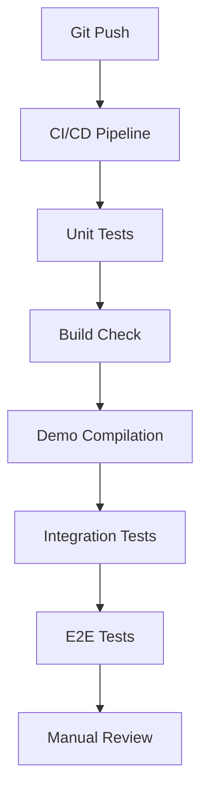

# Demo Testing Architecture Design

## Overview

This document outlines the comprehensive architecture for testing Leptos Motion demos, ensuring reliable validation of animation functionality across different rendering modes and environments.

## Core Architecture

### Testing Pyramid

```
┌─────────────────────────────────┐
│    Manual Visual Testing        │  <- Human verification
│    (Browsers, Devices, UX)      │
├─────────────────────────────────┤
│   Integration Tests (E2E)       │  <- Playwright
│   (Full application flow)       │
├─────────────────────────────────┤
│   Component Tests               │  <- Rust unit tests
│   (MotionDiv, Animation logic)  │
├─────────────────────────────────┤
│   Unit Tests                    │  <- Rust unit tests
│   (AnimationValue, Easing, etc) │
└─────────────────────────────────┘
```

## Demo Testing Matrix

### Test Coverage Requirements

| Demo Type | Unit Tests | Integration Tests | E2E Tests | Manual Tests |
|-----------|------------|-------------------|-----------|--------------|
| CSR Demo  | ✅ Required | ✅ Required      | ✅ Required | ✅ Required |
| SSR Demo  | ✅ Required | ✅ Required      | ⚠️ Limited | ✅ Required |
| Showcase  | ✅ Required | ✅ Required      | ✅ Required | ✅ Required |

## Current Issues & Solutions

### Issue 1: Trunk Server Configuration

**Problem**: `NO_COLOR=1` environment variable causes trunk to fail with invalid flag value.

**Root Cause**: Environment variable conflicts with trunk's color handling.

**Solution**:
```bash
# Override environment for trunk
NO_COLOR= TRUNK_COLOR=auto trunk serve --address 127.0.0.1 --port 3000
```

**Design Decision**: Use explicit environment variable overrides in CI and local development.

### Issue 2: SSR Demo Axum Compatibility

**Problem**: Axum API version conflicts between leptos_axum and direct axum dependencies.

**Root Cause**: Multiple axum versions in dependency tree causing API incompatibilities.

**Solution**:
```rust
// Use compatible axum version
use axum::Router;
use leptos_axum::{generate_route_list, LeptosRoutes};

// Compatible server setup
let app = Router::new()
    .leptos_routes(&leptos_options, routes, App)
    .fallback(leptos_axum::file_and_error_handler)
    .with_state(leptos_options);
```

**Design Decision**: Pin axum version to match leptos_axum requirements.

### Issue 3: Playwright Server Management

**Problem**: Automated server startup fails due to configuration issues.

**Solution**:
```typescript
// playwright.config.ts
webServer: {
  command: 'NO_COLOR= TRUNK_COLOR=auto trunk serve --address 127.0.0.1 --port 3000',
  url: 'http://localhost:3000',
  reuseExistingServer: !process.env.CI,
  timeout: 120 * 1000,
}
```

**Design Decision**: Use environment variable overrides in Playwright configuration.

## Testing Infrastructure Design

### Automated Testing Pipeline



### Test Environment Setup

#### Development Environment
```bash
# Local testing setup
cd examples/comprehensive-showcase
NO_COLOR= TRUNK_COLOR=auto trunk serve --address 127.0.0.1 --port 3000
# In another terminal
npm test
```

#### CI Environment
```yaml
# .github/workflows/test.yml
- name: Run demo tests
  env:
    NO_COLOR: ""
    TRUNK_COLOR: auto
  run: |
    cd examples/comprehensive-showcase
    trunk serve --address 127.0.0.1 --port 3000 &
    sleep 10
    npm test
```

## Test Categories

### 1. Compilation Tests
- Verify all demos compile successfully
- Check MotionDiv usage (not CSS fallbacks)
- Validate AnimationValue and AnimateProp imports

### 2. Unit Tests
- Animation system logic
- MotionDiv component behavior
- AnimationValue type safety

### 3. Integration Tests
- Component interactions
- Animation state management
- Reactive signal integration

### 4. E2E Tests (Playwright)
- Full page loading
- Animation execution
- User interaction handling
- Performance validation

### 5. Manual Tests
- Visual animation quality
- Cross-browser compatibility
- Mobile responsiveness
- Accessibility compliance

## Implementation Plan

### Phase 1: Fix Core Infrastructure (Week 1)
1. Fix trunk environment variable issues
2. Update SSR demo axum compatibility
3. Standardize server startup procedures

### Phase 2: Implement Automated Testing (Week 2)
1. Create working Playwright test suite
2. Implement CI/CD pipeline for demos
3. Add performance regression tests

### Phase 3: Quality Assurance (Week 3)
1. Cross-browser testing matrix
2. Performance benchmarking
3. Accessibility validation

### Phase 4: Documentation & Maintenance (Week 4)
1. Testing documentation
2. Maintenance procedures
3. Monitoring and alerting

## Success Metrics

### Compilation Success
- All demos compile without errors
- Zero warnings in core animation code
- Consistent dependency management

### Test Coverage
- 90%+ unit test coverage for animation logic
- 100% demo compilation validation
- Automated E2E test suite running

### Performance Benchmarks
- Demo load time < 10 seconds
- Animation frame rate > 50fps
- Memory usage within acceptable limits

### Developer Experience
- One-command demo testing
- Clear error messages and debugging
- Comprehensive documentation

## Risk Mitigation

### Technical Risks
1. **Dependency Conflicts**: Pin major versions, use Cargo.lock
2. **Browser Compatibility**: Test matrix across Chrome, Firefox, Safari
3. **Performance Regression**: Automated performance monitoring

### Operational Risks
1. **CI/CD Failures**: Comprehensive error handling and retries
2. **Manual Testing Burden**: Automate as much as possible
3. **Documentation Drift**: Automated documentation validation

## Future Enhancements

### Advanced Testing Features
- Visual regression testing (screenshot comparison)
- Performance profiling integration
- Accessibility automated testing
- Cross-platform mobile testing

### Monitoring & Analytics
- Test execution metrics
- Performance trend analysis
- Failure pattern recognition
- Automated issue reporting
