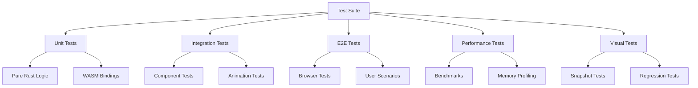

# Leptos Motion: Comprehensive Test Strategy

## Executive Summary

This document outlines a comprehensive testing strategy for Leptos Motion, covering unit tests, integration tests, end-to-end testing, performance benchmarks, and visual regression testing. The strategy ensures reliability, performance, and cross-browser compatibility for the animation library.

## Testing Philosophy

### Core Principles

1. **Test at Multiple Levels**: Unit → Integration → E2E → Visual
2. **Performance is a Feature**: Treat performance regressions as bugs
3. **Cross-Browser Compatibility**: Test on all major browsers
4. **Automation First**: All tests must be automatable
5. **Fast Feedback**: Quick test execution for developer productivity

### Testing Goals

- **Code Coverage**: Minimum 90% for core functionality
- **Performance**: No regression beyond 5% threshold
- **Compatibility**: Support for 95% of browser market share
- **Reliability**: Zero critical bugs in production
- **Developer Experience**: Tests run in <30 seconds locally

## Test Architecture



## Testing Infrastructure

### Required Dependencies

```toml
[dev-dependencies]
# Core testing
wasm-bindgen-test = "0.3"
test-case = "3.1"
pretty_assertions = "1.4"
approx = "0.5"

# Property-based testing
proptest = "1.4"
quickcheck = "1.0"

# Mocking
mockall = "0.12"
wiremock = "0.6"

# Benchmarking
criterion = { version = "0.5", features = ["html_reports"] }
divan = "0.1"

# Browser testing
wasm-pack = "0.12"
playwright-rust = "0.0.20"
fantoccini = "0.19"

# Visual testing
percy-cli = "1.28"
backstopjs = "6.3"

# Code coverage
cargo-tarpaulin = "0.27"
cargo-llvm-cov = "0.5"
```

### Testing Tools Setup

```bash
#!/bin/bash
# install.sh - Install testing tools

# Rust tools
cargo install wasm-pack
cargo install cargo-tarpaulin
cargo install cargo-llvm-cov
cargo install cargo-nextest
cargo install cargo-watch

# Node tools for E2E and visual testing
npm install -g playwright
npm install -g @percy/cli
npm install -g backstopjs

# Browser drivers
npx playwright install
```

## Unit Testing Strategy

### 1. Core Animation Engine Tests

```rust
// tests/unit/engine.rs
use leptos_motion_core::*;
use approx::assert_relative_eq;

#[test]
fn test_interpolation_linear() {
    let interpolator = LinearInterpolator::new();
    assert_relative_eq!(interpolator.interpolate(0.0, 100.0, 0.5), 50.0);
    assert_relative_eq!(interpolator.interpolate(0.0, 100.0, 0.0), 0.0);
    assert_relative_eq!(interpolator.interpolate(0.0, 100.0, 1.0), 100.0);
}

#[test]
fn test_spring_physics() {
    let spring = SpringSimulator {
        stiffness: 100.0,
        damping: 10.0,
        mass: 1.0,
    };

    let trajectory = spring.calculate_trajectory(0.0, 100.0, 0.1, 5.0);

    // Test convergence
    assert!(trajectory.last().unwrap().position - 100.0 < 0.01);

    // Test overshoot characteristics
    let max_position = trajectory.iter().map(|s| s.position).max_by(|a, b| a.partial_cmp(b).unwrap()).unwrap();
    assert!(max_position > 100.0); // Spring should overshoot
}

#[test_case(0.0 => 0.0)]
#[test_case(0.5 => panics)]
#[test_case(1.0 => 1.0)]
fn test_cubic_bezier_bounds(t: f64) -> f64 {
    let bezier = CubicBezier::new(0.4, 0.0, 0.2, 1.0);
    bezier.evaluate(t)
}

// Property-based testing for mathematical correctness
use proptest::prelude::*;

proptest! {
    #[test]
    fn test_easing_monotonic(t in 0.0..=1.0) {
        let ease = ease_in_out_quad;
        let result = ease(t);
        prop_assert!(result >= 0.0 && result <= 1.0);
    }

    #[test]
    fn test_transform_compose_associative(
        x1 in -1000.0..1000.0,
        y1 in -1000.0..1000.0,
        x2 in -1000.0..1000.0,
        y2 in -1000.0..1000.0,
        x3 in -1000.0..1000.0,
        y3 in -1000.0..1000.0,
    ) {
        let t1 = Transform::translate(x1, y1);
        let t2 = Transform::translate(x2, y2);
        let t3 = Transform::translate(x3, y3);

        let result1 = (t1.compose(&t2)).compose(&t3);
        let result2 = t1.compose(&(t2.compose(&t3)));

        prop_assert_eq!(result1, result2);
    }
}
```

### 2. Motion Value Tests

```rust
// tests/unit/motion_values.rs
use leptos::*;
use leptos_motion_core::*;

#[test]
fn test_motion_value_subscription() {
    create_runtime();

    let motion_value = MotionValue::new(0.0);
    let mut received_values = Vec::new();

    motion_value.subscribe({
        let received = received_values.clone();
        move |value| received.push(value)
    });

    motion_value.set(50.0);
    motion_value.set(100.0);

    assert_eq!(received_values, vec![50.0, 100.0]);

    dispose_runtime();
}

#[test]
fn test_motion_value_velocity() {
    create_runtime();

    let motion_value = MotionValue::new(0.0);

    motion_value.set_with_velocity(100.0, 50.0);
    assert_eq!(motion_value.get_velocity(), 50.0);

    dispose_runtime();
}

// Test memory leaks
#[test]
fn test_motion_value_cleanup() {
    use std::rc::Rc;
    use std::cell::RefCell;

    create_runtime();

    let cleanup_called = Rc::new(RefCell::new(false));
    let cleanup_clone = cleanup_called.clone();

    {
        let motion_value = MotionValue::new(0.0);
        motion_value.on_cleanup(move || {
            *cleanup_clone.borrow_mut() = true;
        });
    } // motion_value dropped here

    assert!(*cleanup_called.borrow());

    dispose_runtime();
}
```

### 3. Component Tests

```rust
// tests/unit/components.rs
use leptos::*;
use leptos_testing::*;
use leptos_motion::*;

#[test]
fn test_motion_div_renders() {
    mount_component(|| {
        view! {
            <MotionDiv
                animate=hashmap!{
                    "x" => AnimationValue::Pixels(100.0),
                }
            >
                "Test Content"
            </MotionDiv>
        }
    });

    assert!(query_by_text("Test Content").is_some());
}

#[test]
fn test_animation_props_applied() {
    let wrapper = mount_component(|| {
        view! {
            <MotionDiv
                class="test-element"
                initial=hashmap!{
                    "opacity" => AnimationValue::Number(0.0),
                }
                animate=hashmap!{
                    "opacity" => AnimationValue::Number(1.0),
                }
            />
        }
    });

    let element = wrapper.query_selector(".test-element").unwrap();
    let initial_opacity = get_computed_style(&element, "opacity");

    assert_eq!(initial_opacity, "0");
}
```

## Integration Testing Strategy

### 1. Animation Integration Tests

```rust
// tests/integration/animations.rs
use wasm_bindgen_test::*;
use leptos_motion::*;

wasm_bindgen_test_configure!(run_in_browser);

#[wasm_bindgen_test]
async fn test_animation_completes() {
    let test_app = TestApp::new();

    let handle = test_app.animate(Animation {
        target: ".test-element",
        properties: vec![
            AnimationProperty {
                name: "opacity",
                from: 0.0,
                to: 1.0,
            }
        ],
        duration: Duration::from_millis(100),
    });

    // Wait for animation to complete
    handle.await;

    let final_opacity = test_app.get_computed_style(".test-element", "opacity");
    assert_eq!(final_opacity, "1");
}

#[wasm_bindgen_test]
async fn test_animation_interruption() {
    let test_app = TestApp::new();

    let handle1 = test_app.animate(Animation {
        target: ".test-element",
        properties: vec![("x", 0.0, 100.0)],
        duration: Duration::from_millis(200),
    });

    // Start second animation after 50ms
    sleep(Duration::from_millis(50)).await;

    let handle2 = test_app.animate(Animation {
        target: ".test-element",
        properties: vec![("x", 50.0, 0.0)],
        duration: Duration::from_millis(100),
    });

    handle2.await;

    // First animation should be cancelled
    assert!(handle1.is_cancelled());

    let final_x = test_app.get_transform(".test-element").x;
    assert_eq!(final_x, 0.0);
}
```

### 2. Gesture Integration Tests

```rust
// tests/integration/gestures.rs
#[wasm_bindgen_test]
async fn test_drag_gesture() {
    let test_app = TestApp::new();

    test_app.render(|| view! {
        <MotionDiv
            class="draggable"
            drag=true
            drag_constraints=DragConstraints {
                left: -100.0,
                right: 100.0,
                top: -100.0,
                bottom: 100.0,
            }
        />
    });

    let element = test_app.query(".draggable");

    // Simulate drag
    test_app.simulate_pointer_down(&element, 0.0, 0.0);
    test_app.simulate_pointer_move(&element, 150.0, 150.0);
    test_app.simulate_pointer_up(&element, 150.0, 150.0);

    // Should be constrained to 100, 100
    let transform = test_app.get_transform(&element);
    assert_eq!(transform.x, 100.0);
    assert_eq!(transform.y, 100.0);
}

#[wasm_bindgen_test]
async fn test_hover_gesture() {
    let test_app = TestApp::new();
    let hovered = Rc::new(RefCell::new(false));

    test_app.render({
        let hovered = hovered.clone();
        move || view! {
            <MotionDiv
                class="hoverable"
                while_hover=hashmap!{
                    "scale" => AnimationValue::Number(1.1),
                }
                on_hover_start=move |_| {
                    *hovered.borrow_mut() = true;
                }
            />
        }
    });

    let element = test_app.query(".hoverable");

    // Simulate hover
    test_app.simulate_pointer_enter(&element);

    // Wait for animation
    sleep(Duration::from_millis(50)).await;

    assert!(*hovered.borrow());

    let scale = test_app.get_transform(&element).scale;
    assert_relative_eq!(scale, 1.1, epsilon = 0.01);
}
```

### 3. Layout Animation Tests

```rust
// tests/integration/layout.rs
#[wasm_bindgen_test]
async fn test_layout_animation() {
    let test_app = TestApp::new();
    let (items, set_items) = create_signal(vec![1, 2, 3]);

    test_app.render(move || view! {
        <div class="container">
            <For
                each=items
                key=|item| *item
                children=move |item| view! {
                    <MotionDiv layout=true class=format!("item-{}", item)>
                        {item}
                    </MotionDiv>
                }
            />
        </div>
    });

    // Record initial positions
    let initial_positions = test_app.get_all_positions(".container > div");

    // Reorder items
    set_items.set(vec![3, 1, 2]);

    // Wait for layout animation
    sleep(Duration::from_millis(350)).await;

    // Check final positions
    let final_positions = test_app.get_all_positions(".container > div");

    // Item 3 should now be first
    assert_eq!(final_positions[0].element_id, "item-3");
    assert!(final_positions[0].y < initial_positions[2].y);
}
```

## End-to-End Testing Strategy

### 1. Browser Test Setup

```rust
// tests/e2e/setup.rs
use playwright::*;

pub struct E2ETestContext {
    browser: Browser,
    context: BrowserContext,
    page: Page,
}

impl E2ETestContext {
    pub async fn new() -> Result<Self> {
        let playwright = Playwright::initialize().await?;
        let browser = playwright.chromium().launch(
            BrowserType::launch_builder()
                .headless(true)
                .args(vec!["--enable-gpu"])
                .build()
        ).await?;

        let context = browser.new_context(
            Browser::new_context_builder()
                .viewport(ViewportSize { width: 1280, height: 720 })
                .device_scale_factor(1.0)
                .build()
        ).await?;

        let page = context.new_page().await?;

        Ok(Self { browser, context, page })
    }

    pub async fn navigate_to_example(&self, example: &str) -> Result<()> {
        self.page.goto(
            &format!("http://localhost:8080/examples/{}", example),
            Page::goto_builder().wait_until(LoadState::NetworkIdle).build()
        ).await
    }
}
```

### 2. User Scenario Tests

```rust
// tests/e2e/scenarios.rs
#[tokio::test]
async fn test_complete_user_flow() {
    let ctx = E2ETestContext::new().await.unwrap();

    // Navigate to showcase
    ctx.navigate_to_example("showcase").await.unwrap();

    // Test hero animation on load
    let hero = ctx.page.wait_for_selector(".hero-section").await.unwrap();
    let initial_opacity = hero.get_property("opacity").await.unwrap();
    assert_eq!(initial_opacity, "0");

    // Wait for entrance animation
    ctx.page.wait_for_timeout(1000).await;
    let final_opacity = hero.get_property("opacity").await.unwrap();
    assert_eq!(final_opacity, "1");

    // Test interactive elements
    let button = ctx.page.wait_for_selector(".cta-button").await.unwrap();

    // Hover effect
    button.hover().await.unwrap();
    ctx.page.wait_for_timeout(100).await;
    let hover_scale = button.evaluate("el => getComputedStyle(el).transform").await.unwrap();
    assert!(hover_scale.contains("1.05"));

    // Click animation
    button.click().await.unwrap();

    // Test navigation transition
    ctx.page.wait_for_selector(".next-page").await.unwrap();
}

#[tokio::test]
async fn test_drag_and_drop() {
    let ctx = E2ETestContext::new().await.unwrap();
    ctx.navigate_to_example("drag-drop").await.unwrap();

    let draggable = ctx.page.wait_for_selector(".draggable-item").await.unwrap();
    let drop_zone = ctx.page.wait_for_selector(".drop-zone").await.unwrap();

    // Perform drag and drop
    draggable.drag_to(&drop_zone).await.unwrap();

    // Verify item moved
    let items_in_drop_zone = ctx.page.query_selector_all(".drop-zone .draggable-item").await.unwrap();
    assert_eq!(items_in_drop_zone.len(), 1);
}
```

### 3. Cross-Browser Tests

```rust
// tests/e2e/cross_browser.rs
use test_case::test_case;

#[test_case(BrowserType::Chromium)]
#[test_case(BrowserType::Firefox)]
#[test_case(BrowserType::Webkit)]
#[tokio::test]
async fn test_animations_cross_browser(browser_type: BrowserType) {
    let playwright = Playwright::initialize().await.unwrap();
    let browser = match browser_type {
        BrowserType::Chromium => playwright.chromium(),
        BrowserType::Firefox => playwright.firefox(),
        BrowserType::Webkit => playwright.webkit(),
    }.launch(Default::default()).await.unwrap();

    let page = browser.new_page().await.unwrap();
    page.goto("http://localhost:8080/examples/basic").await.unwrap();

    // Test basic animation works
    let element = page.wait_for_selector(".animated").await.unwrap();
    let initial_transform = element.evaluate("el => el.style.transform").await.unwrap();

    page.wait_for_timeout(500).await;

    let final_transform = element.evaluate("el => el.style.transform").await.unwrap();
    assert_ne!(initial_transform, final_transform);
}
```

## Performance Testing Strategy

### 1. Benchmark Suite

```rust
// benches/performance.rs
use criterion::{black_box, criterion_group, criterion_main, Criterion, BenchmarkId};
use leptos_motion::*;

fn bench_spring_calculation(c: &mut Criterion) {
    let mut group = c.benchmark_group("spring_physics");

    for stiffness in [50.0, 100.0, 200.0, 500.0] {
        group.bench_with_input(
            BenchmarkId::new("calculate", stiffness),
            &stiffness,
            |b, &stiffness| {
                let spring = SpringSimulator {
                    stiffness,
                    damping: 10.0,
                    mass: 1.0,
                };

                b.iter(|| {
                    spring.calculate_position(black_box(0.5))
                });
            },
        );
    }

    group.finish();
}

fn bench_animation_creation(c: &mut Criterion) {
    c.bench_function("create_100_animations", |b| {
        b.iter(|| {
            for i in 0..100 {
                let _ = Animation::new()
                    .target(format!(".element-{}", i))
                    .animate("x", 0.0, 100.0)
                    .duration(1.0)
                    .build();
            }
        });
    });
}

fn bench_concurrent_animations(c: &mut Criterion) {
    let mut group = c.benchmark_group("concurrent_animations");

    for count in [10, 50, 100, 200, 500] {
        group.bench_with_input(
            BenchmarkId::new("animate", count),
            &count,
            |b, &count| {
                let runtime = create_runtime();
                let engine = HybridEngine::new();

                b.iter(|| {
                    let handles: Vec<_> = (0..count)
                        .map(|i| {
                            engine.animate(Animation {
                                target: format!(".element-{}", i),
                                properties: vec![("opacity", 0.0, 1.0)],
                                duration: Duration::from_secs(1),
                            })
                        })
                        .collect();

                    // Tick once
                    engine.tick(16.0);
                });

                dispose_runtime();
            },
        );
    }

    group.finish();
}

criterion_group!(benches, bench_spring_calculation, bench_animation_creation, bench_concurrent_animations);
criterion_main!(benches);
```

### 2. Memory Profiling

```rust
// tests/memory/profiling.rs
use divan::{black_box, AllocProfiler};

#[global_allocator]
static ALLOC: AllocProfiler = AllocProfiler::system();

#[divan::bench]
fn memory_motion_value_creation() {
    let _value = MotionValue::new(0.0);
}

#[divan::bench]
fn memory_animation_lifecycle() {
    let engine = HybridEngine::new();
    let handle = engine.animate(Animation {
        target: ".test",
        properties: vec![("x", 0.0, 100.0)],
        duration: Duration::from_millis(100),
    });

    // Simulate complete lifecycle
    for _ in 0..10 {
        engine.tick(16.0);
    }

    handle.stop();
}

#[divan::bench(sample_count = 100)]
fn memory_leak_detection() -> Vec<MotionValue<f64>> {
    let mut values = Vec::new();

    for i in 0..1000 {
        let value = MotionValue::new(i as f64);
        value.subscribe(|_| {
            black_box(());
        });
        values.push(value);
    }

    values
}
```

### 3. Frame Rate Testing

```rust
// tests/performance/framerate.rs
#[wasm_bindgen_test]
async fn test_maintains_60fps() {
    let test_app = TestApp::new();
    let mut frame_times = Vec::new();

    // Create 100 simultaneous animations
    for i in 0..100 {
        test_app.animate(Animation {
            target: format!(".element-{}", i),
            properties: vec![
                ("x", 0.0, 500.0),
                ("y", 0.0, 500.0),
                ("rotate", 0.0, 360.0),
            ],
            duration: Duration::from_secs(2),
        });
    }

    // Measure frame times
    for _ in 0..120 { // 2 seconds at 60fps
        let start = performance::now();
        test_app.tick().await;
        let frame_time = performance::now() - start;
        frame_times.push(frame_time);
    }

    // Calculate statistics
    let avg_frame_time = frame_times.iter().sum::<f64>() / frame_times.len() as f64;
    let max_frame_time = frame_times.iter().max_by(|a, b| a.partial_cmp(b).unwrap()).unwrap();

    // Assert 60fps (16.67ms per frame)
    assert!(avg_frame_time < 16.67, "Average frame time {} exceeds 16.67ms", avg_frame_time);
    assert!(*max_frame_time < 33.33, "Max frame time {} exceeds 33.33ms (30fps)", max_frame_time);

    // Check for frame drops
    let frame_drops = frame_times.iter().filter(|&&t| t > 16.67).count();
    assert!(frame_drops < 6, "Too many frame drops: {}/120", frame_drops);
}
```

## Visual Regression Testing

### 1. Snapshot Testing Setup

```javascript
// backstop.config.js
module.exports = {
  id: 'leptos_motion_visual_tests',
  viewports: [
    { label: 'phone', width: 320, height: 480 },
    { label: 'tablet', width: 768, height: 1024 },
    { label: 'desktop', width: 1920, height: 1080 },
  ],
  scenarios: [
    {
      label: 'Basic Animation',
      url: 'http://localhost:8080/examples/basic',
      delay: 500,
      misMatchThreshold: 0.1,
      requireSameDimensions: true,
    },
    {
      label: 'Spring Animation',
      url: 'http://localhost:8080/examples/spring',
      delay: 1000,
      selectors: ['.spring-element'],
      misMatchThreshold: 0.2, // Springs can vary slightly
    },
    {
      label: 'Gesture Hover State',
      url: 'http://localhost:8080/examples/gestures',
      hoverSelector: '.hover-target',
      delay: 100,
      misMatchThreshold: 0.1,
    },
    {
      label: 'Layout Animation',
      url: 'http://localhost:8080/examples/layout',
      clickSelector: '.shuffle-button',
      delay: 500,
      misMatchThreshold: 0.1,
    },
  ],
  paths: {
    bitmaps_reference: 'tests/visual/reference',
    bitmaps_test: 'tests/visual/test',
    html_report: 'tests/visual/report',
  },
  engine: 'playwright',
  engineOptions: {
    browser: 'chromium',
    args: ['--force-device-scale-factor=1'],
  },
};
```

### 2. Percy Integration

```yaml
# .percy.yml
version: 2
snapshot:
  widths:
    - 375
    - 768
    - 1280
    - 1920
  min_height: 1024
  percy_css: |
    /* Disable animations for consistent snapshots */
    *, *::before, *::after {
      animation-duration: 0s !important;
      animation-delay: 0s !important;
      transition-duration: 0s !important;
      transition-delay: 0s !important;
    }

static:
  base_url: http://localhost:8080
  files: 'dist/**/*.{html,css,js,wasm}'

discovery:
  allowed_hostnames:
    - localhost
  network_idle_timeout: 500
```

### 3. Visual Test Cases

```rust
// tests/visual/snapshots.rs
use percy_rust::*;

#[test]
fn visual_regression_tests() {
    let percy = Percy::new(env::var("PERCY_TOKEN").unwrap());

    percy.snapshot("Homepage", "http://localhost:8080", &[
        SnapshotOption::Widths(vec![375, 768, 1280]),
        SnapshotOption::MinHeight(1024),
    ]);

    // Test animation states
    percy.snapshot_with_js("Animation Mid-State", "http://localhost:8080/examples/basic", r#"
        // Trigger animation and capture mid-state
        document.querySelector('.animate-button').click();
        await new Promise(resolve => setTimeout(resolve, 500));
    "#);

    // Test responsive behavior
    for width in [320, 768, 1920] {
        percy.snapshot(
            &format!("Responsive Layout - {}px", width),
            "http://localhost:8080/examples/responsive",
            &[SnapshotOption::Widths(vec![width])],
        );
    }
}
```

## Test Data Management

### 1. Test Fixtures

```rust
// tests/fixtures/mod.rs
use leptos_motion::*;
use once_cell::sync::Lazy;

pub static TEST_ANIMATIONS: Lazy<Vec<Animation>> = Lazy::new(|| {
    vec![
        Animation::simple("x", 0.0, 100.0, 1.0),
        Animation::spring("scale", 1.0, 2.0),
        Animation::sequence(vec![
            Animation::simple("opacity", 0.0, 1.0, 0.5),
            Animation::simple("y", 0.0, 50.0, 0.5),
        ]),
    ]
});

pub static TEST_GESTURES: Lazy<Vec<Gesture>> = Lazy::new(|| {
    vec![
        Gesture::Hover,
        Gesture::Tap,
        Gesture::Drag(DragConfig::default()),
        Gesture::Pan(PanConfig::default()),
    ]
});

pub fn create_test_component() -> impl IntoView {
    view! {
        <MotionDiv
            class="test-component"
            initial=hashmap!{"opacity" => 0.0}
            animate=hashmap!{"opacity" => 1.0}
        >
            "Test Content"
        </MotionDiv>
    }
}
```

### 2. Mock Data Generators

```rust
// tests/fixtures/generators.rs
use proptest::prelude::*;

prop_compose! {
    pub fn arb_animation_value()(
        variant in 0..5,
        value in 0.0..1000.0,
    ) -> AnimationValue {
        match variant {
            0 => AnimationValue::Number(value),
            1 => AnimationValue::Pixels(value),
            2 => AnimationValue::Percentage(value / 10.0),
            3 => AnimationValue::Degrees(value),
            _ => AnimationValue::Color(format!("rgba({}, {}, {}, 1)",
                (value as u8) % 256,
                ((value * 2.0) as u8) % 256,
                ((value * 3.0) as u8) % 256
            )),
        }
    }
}

prop_compose! {
    pub fn arb_transition()(
        duration in 0.1..5.0,
        delay in 0.0..1.0,
        ease_type in 0..4,
    ) -> Transition {
        Transition {
            duration: Some(duration),
            delay: Some(delay),
            ease: match ease_type {
                0 => Easing::Linear,
                1 => Easing::EaseInOut,
                2 => Easing::Spring(SpringConfig::default()),
                _ => Easing::Bezier(0.4, 0.0, 0.2, 1.0),
            },
            ..Default::default()
        }
    }
}
```

## Continuous Integration

### 1. GitHub Actions Workflow

```yaml
# .github/workflows/test.yml
name: Test Suite

on:
  push:
    branches: [main, develop]
  pull_request:
    branches: [main]

jobs:
  unit-tests:
    runs-on: ubuntu-latest
    steps:
      - uses: actions/checkout@v3

      - name: Setup Rust
        uses: actions-rs/toolchain@v1
        with:
          profile: minimal
          toolchain: stable
          override: true
          components: llvm-tools-preview

      - name: Cache dependencies
        uses: Swatinem/rust-cache@v2

      - name: Run unit tests
        run: |
          cargo test --lib --all-features
          cargo test --doc

      - name: Generate coverage
        run: |
          cargo llvm-cov --all-features --workspace --lcov --output-path lcov.info

      - name: Upload coverage
        uses: codecov/codecov-action@v3
        with:
          files: lcov.info
          fail_ci_if_error: true

  integration-tests:
    runs-on: ubuntu-latest
    steps:
      - uses: actions/checkout@v3

      - name: Setup Rust and wasm-pack
        run: |
          curl https://rustwasm.github.io/wasm-pack/installer/init.sh -sSf | sh

      - name: Run WASM tests
        run: |
          wasm-pack test --headless --chrome --firefox

      - name: Run integration tests
        run: cargo test --test '*' --all-features

  e2e-tests:
    runs-on: ubuntu-latest
    strategy:
      matrix:
        browser: [chromium, firefox, webkit]

    steps:
      - uses: actions/checkout@v3

      - name: Setup Node.js
        uses: actions/setup-node@v3
        with:
          node-version: '20'

      - name: Install Playwright
        run: |
          npm install -g playwright
          npx playwright install --with-deps ${{ matrix.browser }}

      - name: Build examples
        run: cargo build --examples --target wasm32-unknown-unknown

      - name: Run E2E tests
        run: |
          cargo run --example server &
          sleep 5
          npm test -- --browser=${{ matrix.browser }}

  performance-tests:
    runs-on: ubuntu-latest
    steps:
      - uses: actions/checkout@v3

      - name: Setup Rust
        uses: actions-rs/toolchain@v1
        with:
          toolchain: stable

      - name: Run benchmarks
        run: cargo bench --all-features -- --save-baseline main

      - name: Check performance regression
        run: cargo bench --all-features -- --baseline main --fail-under 95

  visual-tests:
    runs-on: ubuntu-latest
    steps:
      - uses: actions/checkout@v3

      - name: Setup dependencies
        run: |
          npm install -g backstopjs @percy/cli

      - name: Build examples
        run: cargo build --examples --release

      - name: Run visual tests
        run: |
          cargo run --example server &
          sleep 5
          backstop test

      - name: Upload visual diff report
        if: failure()
        uses: actions/upload-artifact@v3
        with:
          name: visual-diff-report
          path: tests/visual/report
```

### 2. Test Coverage Requirements

```toml
# .cargo/config.toml
[coverage]
minimum = 90

[coverage.ignore]
paths = [
    "tests/*",
    "benches/*",
    "examples/*",
    "*/build.rs",
]

[coverage.thresholds]
core = 95      # Core functionality must have 95% coverage
dom = 90       # DOM components need 90%
gestures = 85  # Gesture code needs 85%
```

## Test Execution Strategy

### 1. Local Development

```bash
#!/bin/bash
# scripts/test-local.sh

echo "Running local test suite..."

# Fast feedback tests (< 5 seconds)
echo "Running unit tests..."
cargo nextest run --lib

# Component tests (< 10 seconds)
echo "Running component tests..."
wasm-pack test --headless --chrome

# Watch mode for development
if [ "$1" = "--watch" ]; then
    cargo watch -x "nextest run --lib" -x "clippy -- -D warnings"
fi
```

### 2. Pre-commit Hooks

```bash
#!/bin/bash
# .git/hooks/pre-commit

# Run fast tests
cargo test --lib --quiet

# Check formatting
cargo fmt -- --check

# Run clippy
cargo clippy -- -D warnings

# Check for console.log statements
if grep -r "console\.log" src/; then
    echo "Error: console.log found in source"
    exit 1
fi
```

### 3. Release Testing

```bash
#!/bin/bash
# scripts/test-release.sh

set -e

echo "Running full release test suite..."

# All unit tests
cargo test --all-features

# All integration tests
wasm-pack test --headless --chrome --firefox

# Performance benchmarks
cargo bench --all-features

# Visual regression tests
npm run test:visual

# E2E tests on all browsers
npm run test:e2e:all

# Memory leak detection
cargo test --features leak-detection

# Bundle size check
npm run build
if [ $(stat -f%z dist/leptos-motion.wasm) -gt 51200 ]; then
    echo "Error: Bundle size exceeds 50KB limit"
    exit 1
fi

echo "All tests passed! ✅"
```

## Test Reporting

### 1. Test Metrics Dashboard

```rust
// tools/test-metrics/src/main.rs
use serde::Serialize;

#[derive(Serialize)]
struct TestMetrics {
    coverage: CoverageMetrics,
    performance: PerformanceMetrics,
    reliability: ReliabilityMetrics,
    compatibility: CompatibilityMetrics,
}

#[derive(Serialize)]
struct CoverageMetrics {
    overall: f64,
    core: f64,
    components: f64,
    gestures: f64,
}

impl TestMetrics {
    pub fn generate_report(&self) -> String {
        format!(
            r#"
# Test Metrics Report

## Coverage
- Overall: {:.1}%
- Core: {:.1}%
- Components: {:.1}%
- Gestures: {:.1}%

## Performance
- Average frame time: {:.2}ms
- 99th percentile: {:.2}ms
- Memory usage: {:.1}MB

## Reliability
- Test success rate: {:.1}%
- Flaky tests: {}
- Average test duration: {:.1}s

## Browser Compatibility
- Chrome: ✅
- Firefox: ✅
- Safari: ✅
- Edge: ✅
            "#,
            self.coverage.overall,
            self.coverage.core,
            self.coverage.components,
            self.coverage.gestures,
            self.performance.avg_frame_time,
            self.performance.p99_frame_time,
            self.performance.memory_usage_mb,
            self.reliability.success_rate,
            self.reliability.flaky_count,
            self.reliability.avg_duration_sec,
        )
    }
}
```

## Test Maintenance

### 1. Test Review Checklist

- [ ] Tests are deterministic (no random failures)
- [ ] Tests are isolated (no shared state)
- [ ] Tests are fast (< 100ms for unit tests)
- [ ] Tests have clear names describing what they test
- [ ] Tests check one specific behavior
- [ ] Tests use appropriate assertions
- [ ] Tests clean up resources properly
- [ ] Tests work in both debug and release modes

### 2. Quarterly Test Audit

- Review and remove obsolete tests
- Update test fixtures and mock data
- Optimize slow tests
- Fix flaky tests
- Update browser versions in CI
- Review and update coverage thresholds
- Audit visual regression baselines

## Conclusion

This comprehensive test strategy ensures Leptos Motion maintains high quality, performance, and reliability across all supported platforms. The multi-layered testing approach catches issues early while maintaining fast feedback loops for developers. Regular monitoring and maintenance keep the test suite effective and efficient over time.
